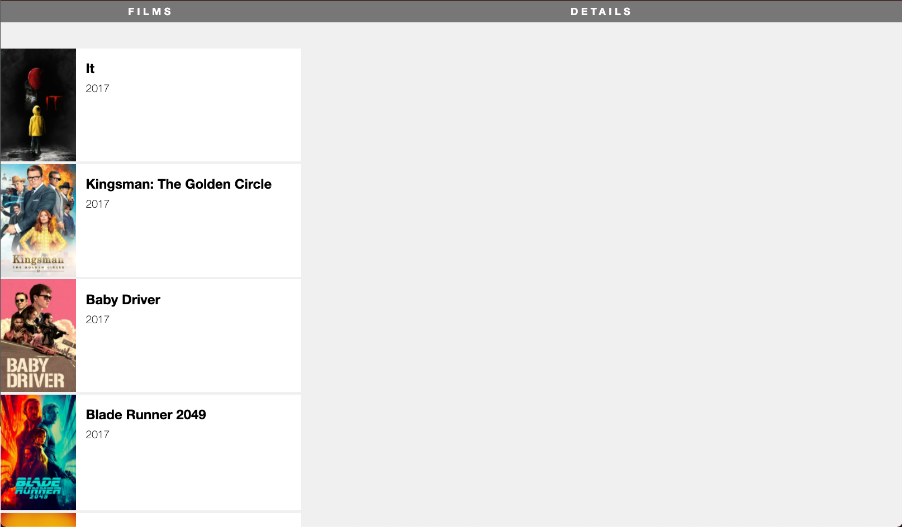

#  React OMDB Films [Part 1]

## Your Mission

Today the plan is to identify the app components, create the overall structure and then split that structure into individual components. You'll pass films as props to each component and ultimately use iteration to render one component for each film. At the end of this exercise, you will have this app:


### Tasks

**Important**: After each step below, check your application to see how it looks before going to the next one. It's good practice to be sure your app is working correctly before adding new functionality.

> NOTE: we'll be working with class-based components for the first two sections of this project. After we've built it out a bit, we'll translate it to functional components with hook-based state and finish it all the React features that are oh so hot right now.

<details>
  <summary>Hint</summary>
  Don't forget any <code>import</code> statements as you add more files.
</details>
---

### Step 0: The Starter Repo

The starter code for this app _does not exist in this repo_. 
0. Clone **[this starter repo](https://github.com/WDI-SEA/react-film-starter-repo)**
1. Install dependencies with `npm install`
2. Run with `npm start`
3. Investigate your starter code. (This is actually the CRA starter code from before hooks were a thing! You're basically looking back in time right now.)

---

### Step 1: Create baseline layout

* Create the two-colum layout; **films** on the left, **details** on the right. Add the following JSX to **App**:

```html
<div className="film-library">
  <div className="film-list">
    <h1 className="section-title">FILMS</h1>
  </div>

  <div className="film-details">
    <h1 className="section-title">DETAILS</h1>
  </div>
</div>
```

* Notice that the starter code has the appropriate CSS already build in for you!

---

### Step 2: Break the columns into components

* Move the two column divs into their own separate components (in separate files), `FilmList.js` and `Details.js`.
* Render the components inside **App** so your app ends up looking exactly like it did in the previous step. 

---

### Step 3: Pass props to the new components

Our films data is stored in the `TMDB.js` file in the `src` folder. Pass the `films` array to each of your new components as props.

If you check your file, it still shouldn't look differently. We're sending the props to the components, but we are not using the props yet.

<details>
  <summary>Hint</summary>
  For now, this step is just changing the <code>App.js</code> file to be sure it imports the film file and passes props.
  <code>
    
    import React, { Component } from 'react';
    import './App.css';
    import FilmListing from './FilmListing';
    import FilmDetails from './FilmDetails';
    import TMDB from './TMDB';
    
    class App extends Component {
      render() {
        return (
          <div className="App">
            <div className="film-library">
              <FilmListing films={TMDB.films} />
              <FilmDetails films={TMDB.films} />
            </div>
          </div>
        );
      }
    }

    export default App;
    
  </code>
</details>

---

### Step 4: Render a film

In the `FilmList` component, render the title of just the first film as an `<h1>`, below the `section-title`.

Does "It" appear on the left side of your browser?

<details>
  <summary>Hint</summary>
  The films prop is an array, and you just want the title from the first one.
</details>

---

### Step 5: Create and render an array of film title elements

* In the `render()` of `FilmListing` (above the return), create an `allFilms` variable that uses [`.map()`](https://developer.mozilla.org/en-US/docs/Web/JavaScript/Reference/Global_Objects/Array/map) to iterate over the array of films and return a `div` with a class of `film-row`, that contains an `h1` with the title for each film.

```jsx
  <div className="film-row">
    <h1>{film.title}</h1>
  </div>
```

* Display `allFilms` underneath the `<h1 className="section-title">FILMS</h1>` heading.

---

### Step 6: Move the film rows to their own component

Now we're going to move each of these `film-row` divs into a `FilmRow` component.

* Create a `FilmRow.js` component. 
* Modify your `allFilms` array so that your `map` function returns a `FilmRow` component.
* Pass the entire film to each `FilmRow` component as a `film` prop.

<details>
  <summary>Hint 1: </summary>
  Don't forget to import <code>FilmRow</code> so you can use it in your <code>map</code> iterator.
</details>

<details>
  <summary>Hint 2: </summary>
  Inside your <code>FilmRow</code> component, <code>film</code> is now, a prop, so you'll need to access it with <code>this.props</code> etc.
</details>

---

### Step 7: Flesh out each film row

* Make each film row in the film list look like the main finished image, using the following markup (replace "TITLE" and "YEAR" with the actual title and year of the film).

```jsx
<div className="film-row">
  

  <div className="film-summary">
    <h1>TITLE</h1>
    <p>YEAR</p>
  </div>
</div>
```

*  You'll have to create the `posterUrl` for each film by combining the prefix `https://image.tmdb.org/t/p/w780/` with each film's `poster_path` property.

<details>
  <summary>Hint: getting the year</summary>
  You'll also have to extract the year from the <code>release_date</code> property. To do this, you could use the <code>split()</code>, <code>substring()</code> or <code>getFullYear()</code> JS method.
</details>

---

### Step 8: Move film posters to their own component

* Create a `Poster` component that resceives a `url` prop.
* Replace the `img` tag in your `FilmRow` component with a `Poster` component that receives a `url`.
* Find a way to populate the `alt` tag for each poster image.

---

### Finished Product So Far:



